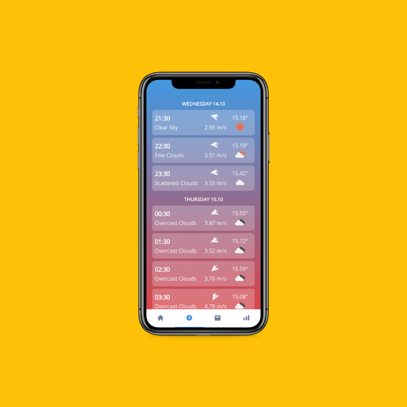
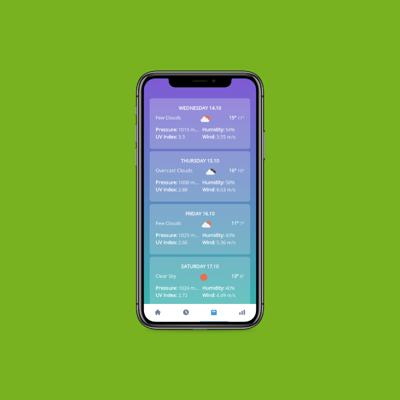
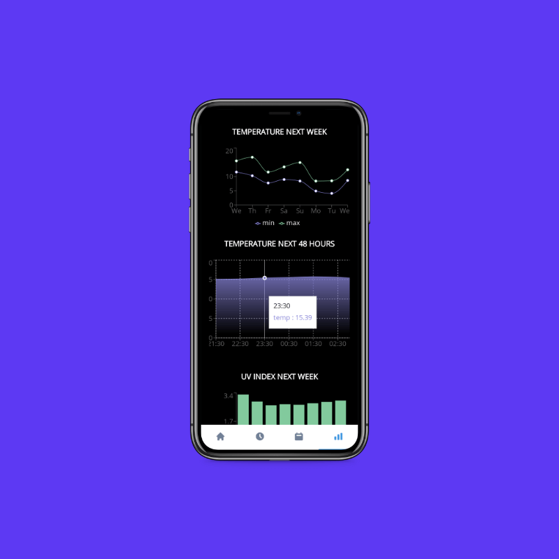

## WeatherX

> #### A clean and minimal weather PWA aim towards mobile

### :sparkles: Features

- Check the current weather forecast
- Check Next 48 hours weather forecast
- Check the Next 7 days weather forecast
- Visually view the Next 48 hours, Next 7 days, and UV Index data in interactive charts
- Search weather forecast for city
- Shows home background images according to weather
- Option to download new background image every time
- Option to view details in Imperial, Metric, and Universal units
- Option to view time in 12/24 hours format

### URL's
https://weatherx-abdulsamad.netlify.app/<code>City Name</code>  
https://weatherx-abdulsamad.netlify.app/<code>City Name</code>/Next48Hours  
https://weatherx-abdulsamad.netlify.app/<code>City Name</code>/Next7Days  
https://weatherx-abdulsamad.netlify.app/<code>City Name</code>/Stats  

### Screenshots

---

---

---

